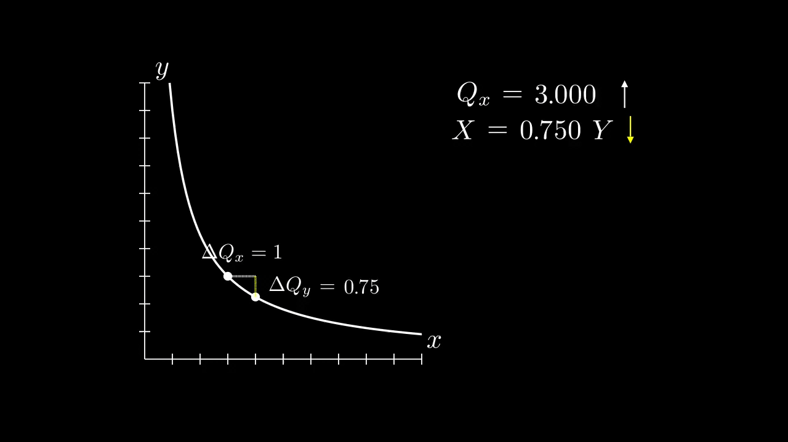
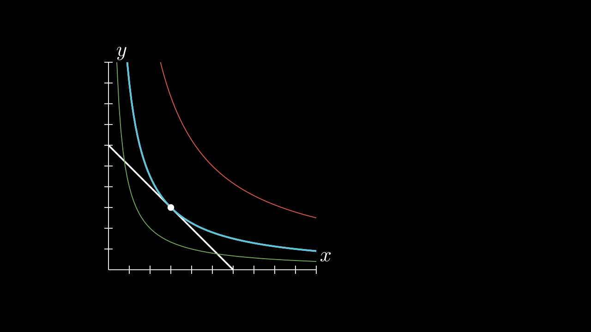

## Budget Constraint

1: budget constraint changing in response to price change of good x (Px)

2: consumption bundle with fixed consumption of good y (Qy=2) changing as budget changes (showing that Qx increases when Px decreases; lower price = more goods)

## Indifference Curve

1: dot moving along a fixed indifference curve

2: dot moving with a moving indifference curve

3: comparing bundles on indifference curve (Illustraiting diminishing marginal rate of substitution)

4: comparing how much of good Y would one trade for a unit of good X on each point on the indifference curve. (Illustraiting diminishing marginal rate of substitution)

5: deriving MRS formulas; MRS changing with Qx

6: showing corresponding budget constraint

